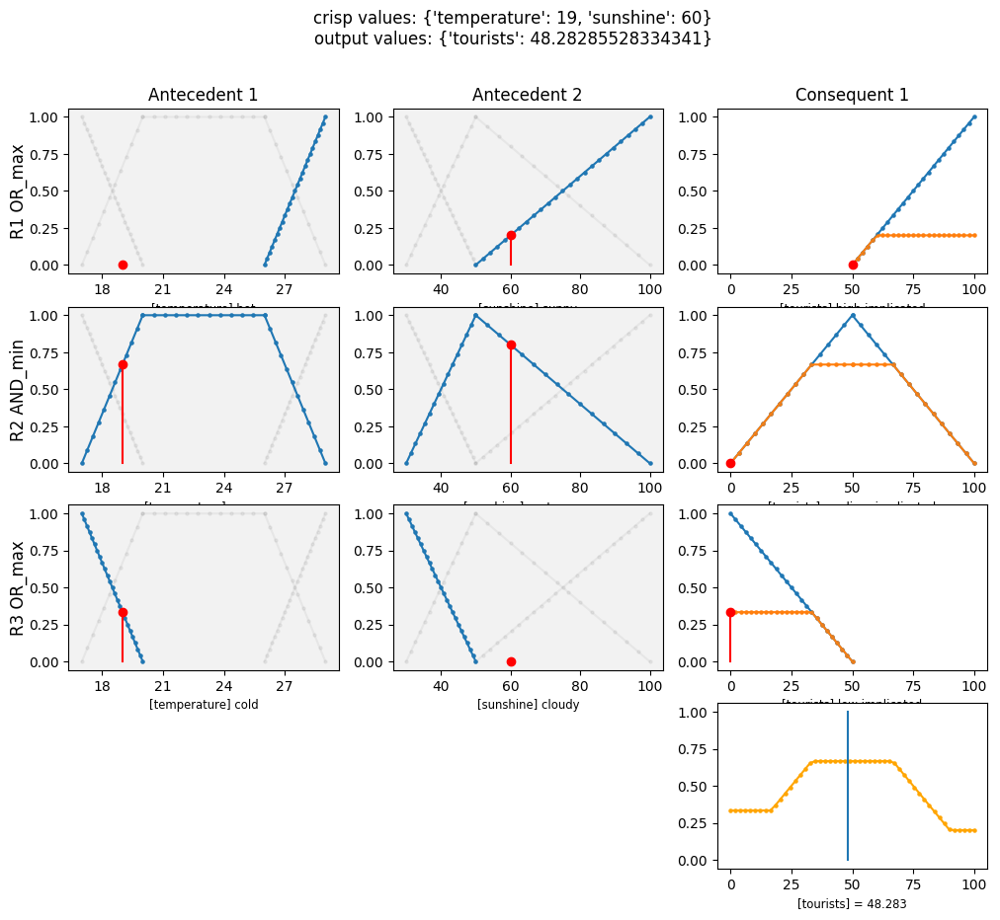
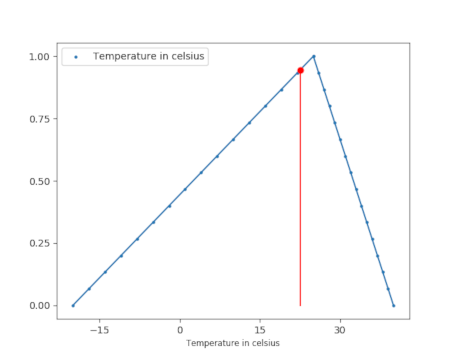

# LFA Toolbox

LFA Toolbox is a set of tools to create, view and play with fuzzy systems. Ideal for students to play with fuzzy systems.

For example a simple example of a fuzzy system to determine if there will be
a lot of tourists given the temperature and the amount of sunshine.

* IF (temperature is hot OR sunshine is sunny), THEN (tourists is high)
* IF (temperature is warm AND sunshine is part_sunny), THEN (tourists is medium)
* IF (temperature is cold OR sunshine is cloudy), THEN (tourists is low)



## Installation

The detailed install instructions can be found here [docs/INSTALL.md](docs/INSTALL.md) but
you basically need to do:

`pip install lfa-toolbox`

## Features

* Singleton and Mamdani fuzzy system types
* Commonly used membership functions (Trap. MF, Triangle MF, Free shape MF,..)
* Multiple consequents
* Default rule
* NOT conditions
* Viewers (membership function viewer, linguistic variable viewer,...)

## Examples

### Membership functions

**TODO** hand-crafted mf + triangular mf + linPWMF + screenshot viewer

```python
from matplotlib import pyplot as plt

from lfa_toolbox.core.mf.triangular_mf import TriangularMF
from lfa_toolbox.view.mf_viewer import MembershipFunctionViewer

# Create a matplotlib plot
fig, ax = plt.subplots()

# Create a triangular membership function
temp_mf = TriangularMF(-20, 25, 40)

# You can fuzzify an input value
fuzzified_value = temp_mf.fuzzify(22.5)
print("MF has been fuzzified to {:.3f}".format(fuzzified_value))

# Or you can visualize the MF using matplotlib
mfv = MembershipFunctionViewer(temp_mf, ax=ax,
                               label="Temperature in celsius")
mfv.fuzzify(22.5)

plt.legend()  # optionally show the legend i.e. "Temperature"
plt.show()
```

And the output will be:



Others shapes of membership functions can be created such as:


Code for this visualization is available at [/lfa_toolbox/examples/readme_examples.py](/lfa_toolbox/examples/readme_examples.py).

### Linguistic variable

**TODO** hand-crafted lv + three points lv + p points lv + screenshot viewer

You can create and visualize linguistic variables by specifing labels and
membership functions for each label.

```python
from matplotlib import pyplot as plt
from lfa_toolbox.core.lv.linguistic_variable import LinguisticVariable
from lfa_toolbox.view.lv_viewer import LinguisticVariableViewer

fig, axs = plt.subplots(3, figsize=(12, 8))

for ax in axs:
lv_temp = LinguisticVariable(
    name="temperature",
    ling_values_dict={
        "cold": LinPWMF([17, 1], [20, 0]),
        "warm": LinPWMF([17, 0], [20, 1], [26, 1], [29, 0]),
        "hot": LinPWMF([26, 0], [29, 1]),
    },
)
viewer = LinguisticVariableViewer(lv_temp, ax=ax)
viewer.fuzzify(26.6)
viewer.fuzzify(21.8)

fig.tight_layout()
plt.show()
```


You can also use the class `PPointsLV` to create interpretable more
conveniently.

```python
from matplotlib import pyplot as plt
from lfa_toolbox.view.lv_viewer import LinguisticVariableViewer
from lfa_toolbox.core.lv.p_points_lv import PPointsLV

fig, ax = plt.subplots()
# PPointsLV helps you create a linguistic variable that is human
# interpretable and generate automatically fuzzy labels for you.
lv = PPointsLV("Github stars", [0, 50, 300, 1000])
LinguisticVariableViewer(lv, ax=ax)

plt.show()
```


### Fuzzy System

You can create an entire fuzzy system by hand. LFA Toolbox supports Singleton
and Mamdani fuzzy systems, default rule and NOT conditions. You can see how it
works by looking at the examples here [/lfa_toolbox/examples](/lfa_toolbox/examples).

Take a look at the [`car_problem_slides`](/lfa_toolbox/examples/car_problem_slides) folder.
It shows a problem where we want to regulate the push of a pedal to maintain
the speed of a car. It starts with a Mamdani fuzzy system and gradually
simplifies it by first replacing it with a Singleton fuzzy system, then by
adding a default fuzzy rule and finally by using NOT conditions.

## Integration with Trefle

[Trefle](https://github.com/krypty/trefle) is a scikit-learn compatible
estimator implementing the FuzzyCoCo algorithm that uses a cooperative
coevolution algorithm to find and build interpretable fuzzy systems.

See [Trefle's Github](https://github.com/krypty/trefle) to learn how to
install it.

Basically after running Trefle you can save the best fuzzy system and fine tune
it with LFA Toolbox. For example you can change the values of the membership
functions or remove a too specific fuzzy rule.

See [/lfa_toolbox/examples/import_a_trefle_fuzzy_system.py](/lfa_toolbox/examples/import_a_trefle_fuzzy_system.py) example.

## Deployment and Tests

Both documentations are available in the `docs` folder.


## Credits

* Gary Marigliano (developper)
* Carlos Andrés PEÑA REYES (project manager)
* [CI4CB Team](http://iict-space.heig-vd.ch/cpn/)


